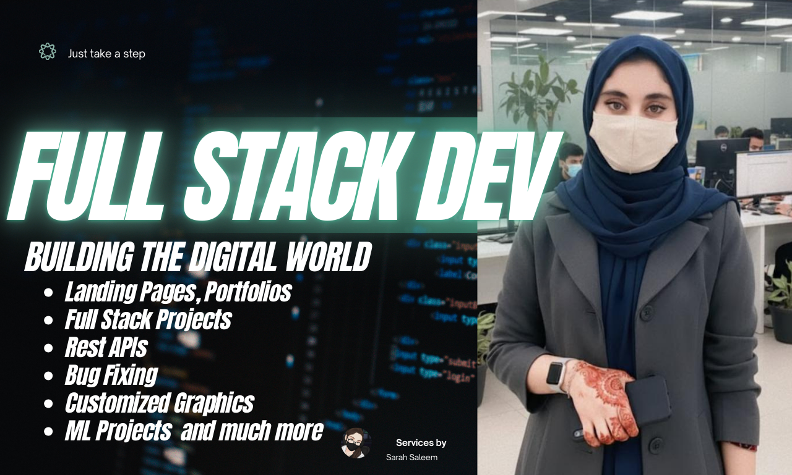

<!-- Hero Section -->

  

<h1 align="center" style="margin-top:20px;">International Certified Full Stack Developer & MERN ML Engineer</h1>

I am <strong>Sara Saleem</strong>, Full-Stack MERN Developer & Debugging Expert. Masters in IT, CM Punjab Merit Scholar. Built 12+ live web apps (React, Node.js, MongoDB) like <a href="https://accelerate.veevotech.com/index" target="_blank">Accelerate</a>, SkyTrack AI, Mercedes & Binance Clones. Fixed 200+ bugs in frontend, backend & APIs. Deployed on Vercel/Netlify. 50K+ lines of clean JS. Lecturer & MERN Dev at veevotech.com. Trusted by clients in 15+ countries.

  <a href="https://sarasaleem.vercel.app/" target="_blank" style="background-color:#FF4C29; color:white; padding:15px 30px; font-size:18px; border-radius:10px; text-decoration:none; font-weight:bold;">
    Learn More About Me
  </a>

